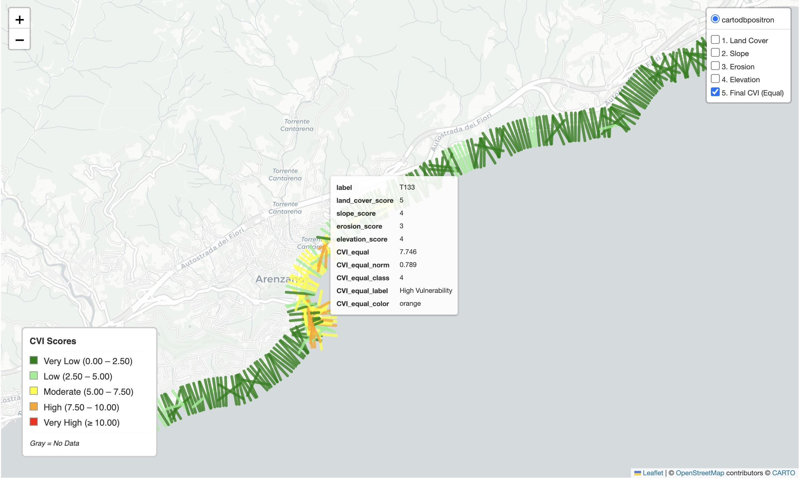
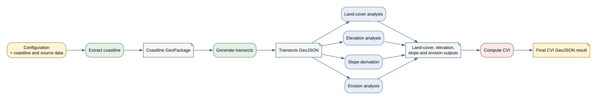

# HARTIS D001 Contribution Draft

Status: working draft, updated with provenance-chain evidence on 2026-10-07
Role: D100 Workflow Profiler
Organisation: HARTIS Integrated Nautical Services P.C.

## Part A — Main Report Section

### HARTIS Integrated Nautical Services P.C.

**Deliverable:** D100 Workflow Profiler

#### Overview

HARTIS is profiling a real Coastal Vulnerability Index (CVI) workflow as a provenance chain of geospatial processing activities. The workflow is a containerised, step-based CWL workflow that uses coastline geometry, transects, land-cover data, elevation data and erosion information to produce coastal vulnerability results. The HARTIS contribution tests a working provenance representation against this workflow and identifies the inputs, outputs, processing activities, parameters and relationships that need to be recorded for reproducible workflow execution.

The first working example describes transect generation from coastline geometry. A two-step chain then connects coastline extraction to transect generation, including the AOI, Nominatim and Overpass dependencies. A normalized full-workflow candidate separates the workflow definition, eight design-time processing plans, eight runtime activities and the input, intermediate, external and output entities. The contribution also includes provisional generic Geoprocessing Activity definitions derived from the AI-DGGS Flood Impact Index pilot, together with a demonstrator record showing DGGS cell indexing before the FII calculation.

#### Challenges

The main open points are the relationship between a provenance profile, a process-type Register and a concrete workflow run, and the final form of the process-type identifiers. The CVI workflow also contains operations with different levels of generality: slope derivation and raster analysis are reusable GIS activities, while coastline acquisition and final CVI scoring are more dependent on the application. The current examples therefore keep process-type identifiers provisional and distinguish generic activity definitions from application-specific workflow logic.

#### Future Work

After OSPD 2026, HARTIS plans to assess the methodology across additional, more mature workflow platforms and in the context of European digital-twin infrastructure for coastal and marine applications. The methodology combines workflow profiling, explicit description of processing activities and inputs/outputs, provenance capture, validation evidence and reproducible execution. The aim will be to evaluate its portability, interoperability and reproducibility across different workflows and execution environments.

#### Figure

Figure: CVI workflow result showing coastal transects and the calculated equal-weight CVI classification.

Figure: CVI workflow provenance chain from inputs through coastline extraction, transect generation and indicator calculations to the final CVI result.

## Part B — Contribution Details

### B1. Contribution Overview

The contribution has two connected evidence tracks:

1. The CVI workflow is the primary D100 profiling case. It provides a non-trivial chain of activities and intermediate entities.
2. The AI-DGGS FII workflow provides additional evidence for generic Geoprocessing Activity definitions that are directly used in a real spatial processing workflow.

The repository evidence artifacts include:

- a CVI processing-step inventory;
- provisional CVI process-type candidates;
- a single-step transect-generation provenance example;
- a two-step coastline-to-transects provenance chain;
- a normalized full-workflow provenance candidate with separate plans, runtime activities and entities;
- an artifact manifest with file sizes and SHA-256 hashes;
- a processing-step Building Block implementation draft;
- `GA018`-`GA026` provisional activity definitions;
- `PRV004`, a demonstrator record for assigning spatial inputs to DGGS cell identifiers before the FII calculation.

### B2. Provenance Implementation

The current representation models a processing activity with:

- an activity identifier and label;
- a provisional `processType` value;
- `used` input entities;
- `generated` output entities;
- `qualifiedUsage` entries for input roles;
- associations with the workflow script and container;
- parameters needed to understand or reproduce the operation;
- links between activities through their generated and used entities.

The first focused example is `generate-transects`. It consumes `coastline.gpkg`, produces `transects.geojson`, and records parameters such as spacing, transect length, processing CRS and output CRS. The two-step chain adds `extract-coastline` and keeps the AOI, Nominatim and Overpass responses visible as upstream entities. The normalized full candidate extends the same pattern across the eight CVI steps and separates the workflow definition, design-time plans, runtime activities and entities.

### B3. Process Types and Register Contribution

The CVI workflow produced candidate terms including configuration validation, coastline data acquisition, transect generation, land-cover analysis, slope derivation, erosion-data integration, elevation analysis and vulnerability-index scoring. These remain provisional until the Register model and URI pattern are settled.

The AI-DGGS FII pilot supplied additional generic activity definitions based on operations actually performed by the workflow:

- `GA018` Slope derivation;
- `GA019` D8 flow-direction derivation;
- `GA020` D8 flow-accumulation derivation;
- `GA021` Watershed/catchment delineation;
- `GA022` Stream-network extraction;
- `GA023` Distance-to-feature calculation;
- `GA024` Zonal raster statistics;
- `GA025` Raster sampling at points;
- `GA026` DGGS cell indexing.

These definitions are intentionally separate from the application-specific FII score. `PRV004` demonstrates the use of `DGGS cell indexing`: spatial inputs and a grid resolution are used to produce DGGS cell identifiers, which are then used by the subsequent FII calculation.

### B4. Register Implementation

HARTIS is contributing definitions and usage evidence as a participant rather than implementing the Register. The entries are kept provisional and are intended to follow the shared Register and Building Block conventions once the final intake and URI patterns are available.

### B5. Validation Evidence

The current evidence is structural, workflow-based and linked to repository artifacts. It checks that:

- each activity has identifiable inputs and outputs;
- intermediate entities connect one processing step to the next;
- input roles can be recorded with `qualifiedUsage`;
- activity parameters are available for the representative transect-generation step;
- the full CVI candidate contains eight plans and eight runtime activities;
- every runtime activity references a design-time plan;
- the final CVI activity consumes the four indicator outputs;
- the provenance entities correspond to concrete repository files recorded with size and SHA-256 hash;
- the generic activity definitions correspond to operations present in the AI-DGGS FII workflow.

The structural checks pass. Validation against the shared OGC provenance Building Block and final Register identifiers remains part of the next implementation stage; the shared OGC Docker validation toolchain remains pending.

Within OSPD 2026, HARTIS will use the pilot results to refine the normalized CVI provenance chain, align the examples with the agreed shared provenance profile and Register URI pattern, and assess whether the provenance example and process-type definitions are ready for a mature Building Block or Register submission.

A successful GitHub Actions run (`37607636698`) executed the containerised CWL
workflow end to end. It produced the coastline GeoPackage, transects, the
four indicator outputs and the final `transects_with_cvi_equal.geojson` result.
The run also generated a CWLProv Research Object containing
`primary.cwlprov.json` and `primary-output.json`. The sanitized evidence
export passed the credential-value check and is suitable for retaining as a
reproducibility record.

### B6. Provenance Encoding

The working examples use a JSON/JSON-LD-oriented representation with explicit identifiers, types, activities, entities and relationships. The focused examples demonstrate a single step and a two-step chain. The normalized full candidate additionally separates workflow definition, design-time plans, runtime activities and entities. This format is convenient for documenting a compact processing step and for extending the example to a connected workflow chain, but it remains a working choice and will be compared with the common OSPD provenance profile and any required Building Block transforms.

### B7. Findings And Lessons Learned

The CVI workflow shows that a useful provenance profile must distinguish the reusable processing operation from the application-specific scoring logic. It must also preserve the relationship between an activity definition, a concrete runtime activity, its input entities, its generated entities and the software/container that executed it.

The FII workflow shows that generic activity definitions are strongest when they are derived from real operations such as D8 processing, zonal statistics and DGGS indexing, rather than invented only for the Register.

### B8. Recommendations

- Keep generic activity definitions separate from application-specific index calculations.
- Allow a workflow profile to link a runtime activity to a registered or provisional process type.
- Keep the provenance representation able to describe both a single processing step and a connected workflow chain.
- Provide clear validation feedback for activity, entity and qualified-usage structures.

### B9. References

- HARTIS CVI workflow definition and execution inputs: [`cvi_workflow.cwl`](../../cvi_workflow.cwl) and [`job_cvi.yaml`](../../job_cvi.yaml).
- HARTIS single-step provenance example: [`cvi_transect_generation_step.json`](../building-block/prov-processing-step/examples/cvi_transect_generation_step.json).
- HARTIS coastline-to-transects provenance chain: [`cvi_coastline_to_transects_provenance_chain.json`](../provenance/cvi_coastline_to_transects_provenance_chain.json).
- HARTIS normalized full-workflow provenance candidate: [`cvi_full_workflow_design_runtime_entities.json`](../provenance/cvi_full_workflow_design_runtime_entities.json).
- HARTIS processing-step Building Block draft: [`bblock.json`](../building-block/prov-processing-step/bblock.json), [`schema.yaml`](../building-block/prov-processing-step/schema.yaml) and [`examples.yaml`](../building-block/prov-processing-step/examples.yaml).
- HARTIS activity definitions and `PRV004` demonstrator record: [`geoprocessing-activities.jsonld`](../register/geoprocessing-activities.jsonld).
- HARTIS artifact manifest with file sizes and SHA-256 checksums: [`cvi_workflow_artifact_manifest.json`](../validation/cvi_workflow_artifact_manifest.json).
- W3C PROV-O: https://www.w3.org/TR/prov-o/.
- Common Workflow Language Specification: https://www.commonwl.org/specification/.
- CWLProv provenance profile: https://github.com/common-workflow-language/cwlprov.
- OGC Location Building Blocks: https://blocks.ogc.org/.
- OGC API - Processes: https://ogcapi.ogc.org/processes/overview.html.
